# Save to Marvin Chrome Extension
A simple Chrome extension to save the current web page to the [Amazing Marvin](https://amazingmarvin.com/) productivity service.

NOTE: This is an independent project, not affiliated with the makers of Amazing Marvin.

## How It Works
1. Visit a web page that corresponds to a task you want to do: perhaps a document to read, the site where you have to pay a bill, or the GMail message to respond to.

    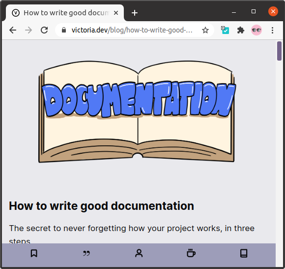

2. Click the Save to Marvin button in the Chrome toolbar.

    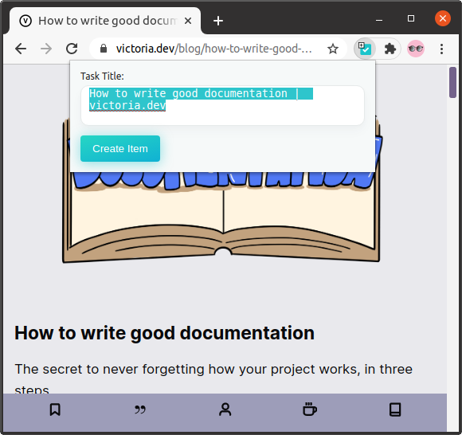

3. Type the text for your new task. You can use projects like `#work` and day specifiers like `+thursday`, but they won't autocomplete, they'll only take effect after the task is saved.

    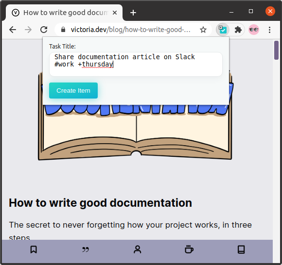

4. Press Enter or click the **Create Item** button. You'll see a loading indicator, and then your new task will be created.

    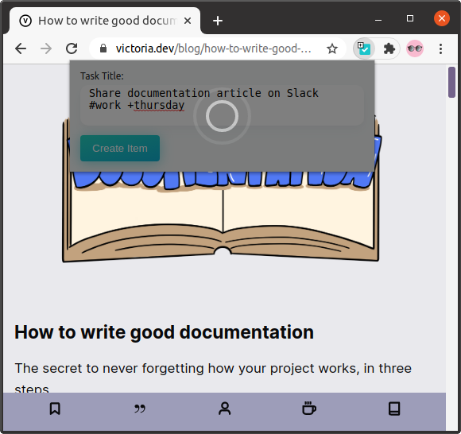

5. If you want, you can click **Open Marvin** to go see your new item.

    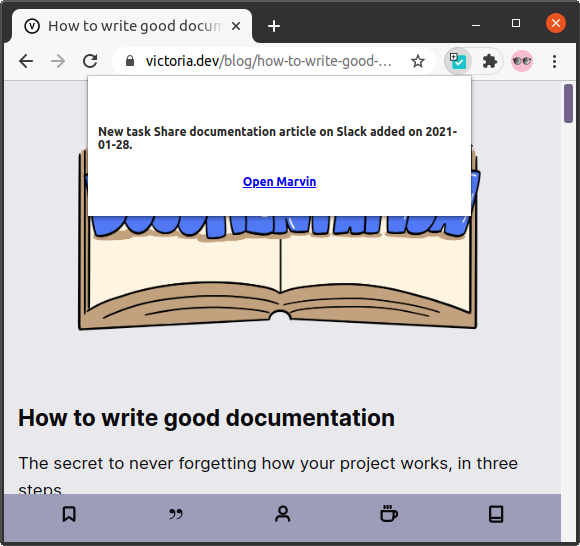

    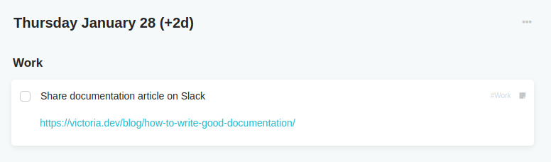

## How To Install

* Go to the page on the Chrome Store (TBD)
* Install the extension (TBD)
* Once installed, you may need to pin the extension to the toolbar
* You will need to set your Marvin API Key (the extension will prompt you if you try to use it without doing this):
    * Right-click the extension icon, and choose **Options**

        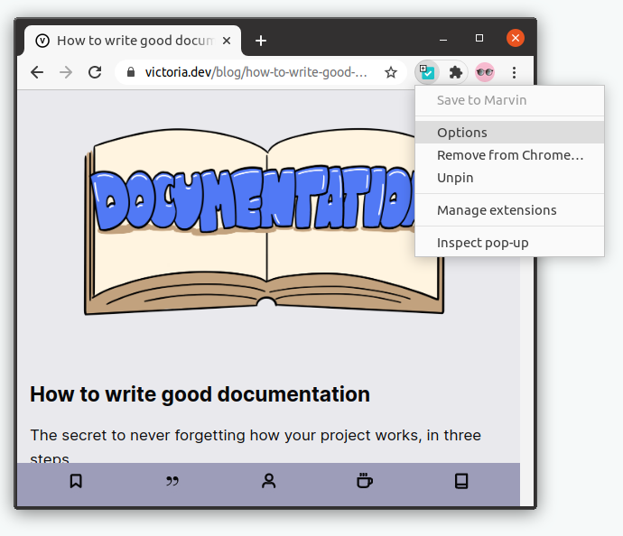

    * In another window, go to Amazing Marvin, and click the "hamburger" menu in the upper-right corner, and select **Strategies**

        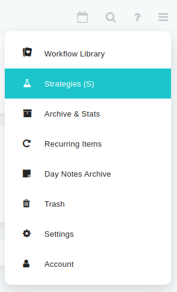

    * In the search box, type `api` to quickly filter to the **API (beta)** strategy. Click the **Settings** button on that one.

        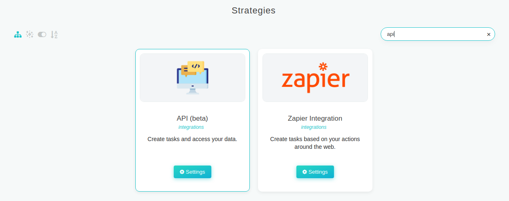

        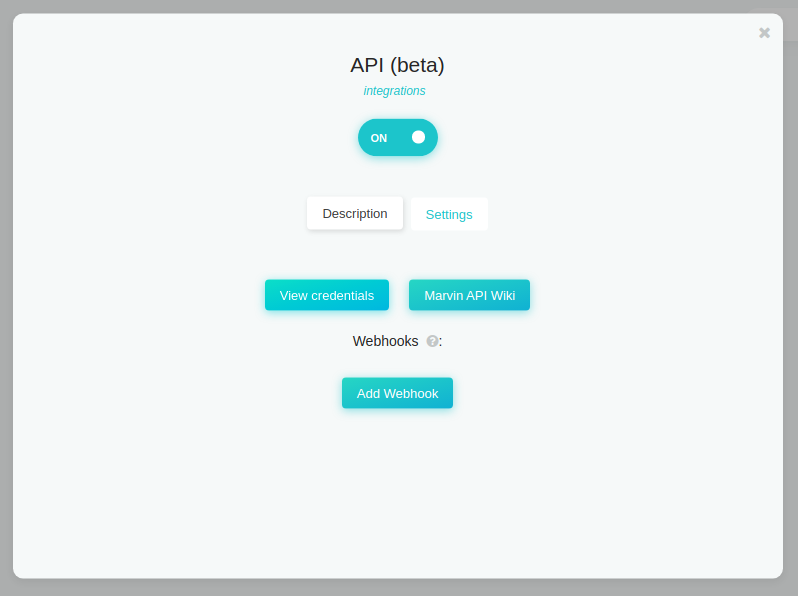

    * Click **View Credentials**

        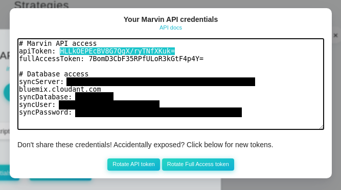

    * Copy the text beside `apiToken:`, then go back to the Save to Marvin extension options window/tab and paste it into the **Amazing Marvin API Key:** text field. Click **Save**, then close that tab.

        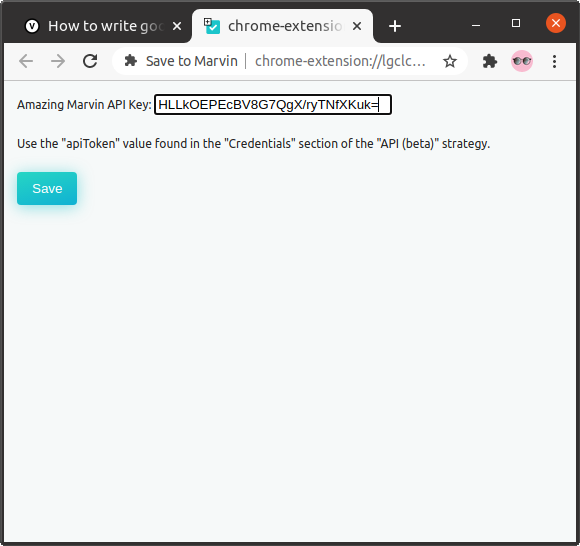

* You should now be ready to go!

## Installing Without Store/For Development

You can also install the extension without using the Chrome Store, which is useful for development and experimentation.

* Clone this repo somewhere on your machine
* In Chrome's triple dot menu in the upper right, select **More tools** > **Extensions**
* Turn on the **Developer mode** switching on the upper right
* Click **Load unpacked**, and select the `extension` subdirectory of this project on your machine

## Support
This was created as a short side project in January 2021 to scratch my own itch.
As such, I'm not allocating any further time to pull requests, bug reports, or to provide any other support.

However, I'm sharing this in case anyone else finds it useful. You're free to use it, adapt it, or use it as the basis for some other project.

## Privacy Policy
You can find the privacy policy for this software [here](PrivacyPolicy.md).
